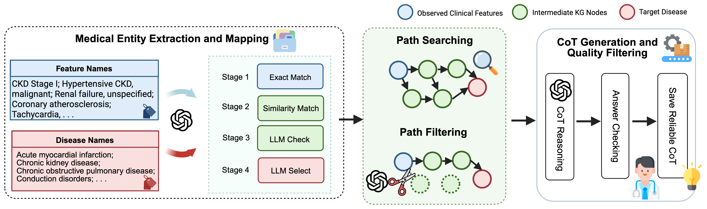

<h1 align="center"> 🩺 Knowledge Graph Augmented Large Language Models for Disease Prediction  </h1>

<p align="center">
  📃 <a href ="https://arxiv.org/pdf/2512.01210" target="_blank">Paper</a> 
</p>

## 🧠 1. Project Summary
Electronic health records (EHRs) support strong prediction but often provide coarse, post hoc explanations that are hard to use for patient-level decisions. This repository implements a **KG-guided chain-of-thought (CoT)** framework for next-visit disease prediction on MIMIC-III. We map ICD-9 concepts to PrimeKG, mine disease-relevant nodes and shortest paths, generate CoT with KG evidence, and keep only samples whose final conclusion matches observed outcomes. The final release here keeps the **KG-guided LLaMA-3.1-Instruct-8B pipeline only**.

## 🎯 2. Task Description
We solve next-visit disease prediction over longitudinal structured visits.

- Input: index visit `x_t` as a binary ICD-9 feature vector (`N=7,423`).
- Target: for each disease `d`, predict whether it appears at visit `t+1` (`y_{t+1}^{(d)} in {0,1}`).
- Output: disease probability and binary decision, plus KG-guided reasoning text.
- Scope in this repo: 10 diseases reliably mapped from MIMIC-III ICD-9 concepts to PrimeKG.

## 🧩 3. Method Overview
The implemented pipeline is:

1. **KG Entity Mapping**: ICD-9 text entities are aligned to PrimeKG nodes (exact/similarity/LLM validation).
2. **Relevance + Path Mining**: for each target disease, disease-relevant feature nodes are selected and shortest paths are mined from PrimeKG.
3. **KG-Guided CoT Generation**: visit features + relevant present/absent entities + disease paths are used to generate reasoning.
4. **Filtering**: keep examples only if the generated final Yes/No conclusion matches ground truth.
5. **Fine-tuning + Evaluation**: train LLaMA-3.1-Instruct-8B on filtered KG-guided CoT and evaluate multilabel metrics.

Pipeline figures:




## 🗃️ 4. Data
This repository keeps only final artifacts required for the KG-guided pipeline.
The EHR source cohort is **MIMIC-III**, and the external biomedical KG source is **PrimeKG**.
MIMIC-III provides the visit-level ICD-9 features/labels, while PrimeKG provides entity anchors and reasoning paths used for KG-guided CoT.

MIMIC-III setting used in experiments:

- 12,353 labeled index visits (visit pairs)
- 7,423 ICD-9 binary features per index visit
- 10 PrimeKG-mapped target diseases
- Evaluation split file: `dataset/unseen_exclude_1000.json`

Final KG and mapping files:

- `data/relevence.txt`
- `data/filtered_path_mappings.json`
- `data/disease_paths/*.txt`
- `data/Entity_Matching/existing_nodes_manually_refined.txt`
- `data/Entity_Matching/existing_edges_manually_refined.txt`

Required external KG file (not tracked in this repo due size):

- `data/prune_kg.csv` (build/export this from PrimeKG and place it at this path, or pass a custom path with `--graph_csv`)

Final MIMIC feature files:

- `data/mimic/hyperedges-mimic3_truncated.txt`
- `data/mimic/edge-labels-mimic3_updated_truncated.txt`
- `data/mimic/edge_text.json`
- `data/mimic/node_text.json`
- `data/mimic/disease-filter_updated.json`

Final CoT files:

- `cot_dataset/cot_dataset_with_paths.jsonl`
- `cot_dataset/cot_dataset_1000_patient_with_paths.json`

Data access note:

- Original MIMIC-III raw tables are not included in this repo.
- PrimeKG can be obtained from the official project resources: https://github.com/mims-harvard/PrimeKG
- CRADLE data is not included in this repo; obtain it from the original data owners/institutional process if needed for transfer experiments.

## 🗂️ 5. Project Structure
- `code/`: KG mapping/path mining, CoT generation/filtering, and evaluation code.
- `scripts/`: SLURM runners for path extraction, CoT generation, fine-tuning, and evaluation.
- `llm_training_config/`: final LLaMA-Factory YAML for KG-guided LLaMA-8B.
- `data/`: final KG/mapping and MIMIC feature artifacts.
- `cot_dataset/`: KG-guided CoT training artifacts.
- `results/`: kept final KG-guided evaluation summaries.
- `dataset/`: split/index files used for evaluation.
- `fig/`: README/paper figures.

## 6. Usage
### 🚀 6.1 Setup
```bash
# 1) Set up the LlamaFactory environment first (follow official repo setup):
# https://github.com/hiyouga/LlamaFactory

# 2) In this repo, activate the same environment and install additional deps
conda activate your_env
pip install -r requirements.txt

# 3) Set path placeholders used by provided scripts
export REPO_DIR=your_path_to_repo
export LLAMAFACTORY_DIR=your_path_to_LlamaFactory
export SCRATCH_BASE=your_path_to_cache_dir
export MODEL=your_path_to_model_checkpoint

# 4) Export runtime keys/tokens
export AZURE_OPENAI_ENDPOINT="https://your_azure_openai_endpoint"
export AZURE_OPENAI_API_KEY="..."
export OPENAI_API_KEY="..."  # needed for optional GPT_Filter.py
export HF_TOKEN="..."
export WANDB_API_KEY="..."
```

Notes:
- `requirements.txt` is for additional project dependencies on top of LLaMA-Factory.
- RAPIDS packages (`cudf`, `cugraph`, `rmm`) are optional and should be installed with conda in a CUDA-matched environment.
- Replace all placeholder paths in scripts/configs (for example `your_path_to_repo`, `your_path_to_output`, `your_path_to_model_checkpoint`, `your_path_to_LlamaFactory`).

### 6.2 Optional: Re-run entity mapping
```bash
python code/Extract_KG_entity.py
python code/entity_match.py
python code/GPT_Filter.py
python code/print_matched.py
```
Required files: `data/prune_kg.csv`, `data/mimic/edge_text.json`, `data/mimic/node_text.json`.
(`data/prune_kg.csv` must be prepared from PrimeKG; it is intentionally not uploaded here due to its large size.)

### 6.3 Generate disease-level path sets
```bash
python code/find_path.py \
  --relevance_txt data/relevence.txt \
  --graph_csv data/prune_kg.csv \
  --out_dir data/disease_paths \
  --out_mapping_json data/path_mappings_raw.json
```
Outputs per-disease path files and raw mapping; curated mapping used downstream is `data/filtered_path_mappings.json`.

### 6.4 Generate patient-level path traces (optional diagnostics)
```bash
bash scripts/mimicToPath.sh
```
Output files are written under `results/kg_paths/`.

### 6.5 Generate KG-guided CoT dataset
```bash
bash scripts/generate_COT_dataset_new.sh
```
Main output: `cot_dataset/cot_dataset_with_paths.jsonl`.

### 6.6 Filter CoT and format training JSON
```bash
python code/filter_and_format_alpaca.py \
  --in_jsonl cot_dataset/cot_dataset_with_paths.jsonl \
  --out_alpaca_json cot_dataset/cot_dataset_1000_patient_with_paths.json \
  --out_bad_json cot_dataset/cot_dataset_1000_patient_with_paths_parse_error.json \
  --out_mismatch_json cot_dataset/cot_dataset_1000_patient_with_paths_mismatch.json
```

### 6.7 Fine-tune LLaMA-8B (KG-guided)
Follow LlamaFactory dataset setup first:

1. Put `cot_dataset/cot_dataset_1000_patient_with_paths.json` into the data location used by your LlamaFactory installation.
2. Register/update the dataset entry in LlamaFactory `dataset_info.json`.
3. Adjust paths in `llm_training_config/llama3-8b_cot_noisy_1000_path.yaml` (for example `dataset_dir`, `deepspeed`, `output_dir`, and model/checkpoint path as needed).
4. Then run finetuning:

```bash
bash scripts/finetune_llama3-8b.sh
```
Uses `llm_training_config/llama3-8b_cot_noisy_1000_path.yaml`.

### 6.8 Evaluate and recompute metrics
```bash
# ensure MODEL points to your fine-tuned checkpoint
bash scripts/evaluate_llama3-8b-instruct_predict_all_label.sh
bash scripts/evaluate_metric_from_jsonl.sh
```
The second script reads `per_sample_generations.jsonl` generated by the first script.

## 📎 6.9 Note
- Training uses LLaMA-Factory (`llamafactory` in `requirements.txt`).
- RAPIDS packages (`cudf`, `cugraph`, `rmm`) should be installed with CUDA-compatible versions (typically via conda).
- This repository excludes original/raw MIMIC-III and CRADLE datasets; only processed pipeline artifacts are kept.
- `data/prune_kg.csv` is also excluded from git because of file size; regenerate/download it from PrimeKG resources above.

## 📌 Citation 

If you find our work useful for your research and applications, please cite using this BibTeX:
```bibtex
@inproceedings{wang2026kg_augmented_llm_disease_prediction,
  title     = {Knowledge Graph Augmented Large Language Models for Disease Prediction},
  author    = {Wang, Ruiyu and Vinh, Tuan and Xu, Ran and Zhou, Yuyin and Lu, Jiaying and Pasquel, Francisco and Ali, Mohammed and Yang, Carl},
  booktitle = {Proceedings of the American Medical Informatics Association Informatics Summit (AMIA)},
  year      = {2026}
}
```

